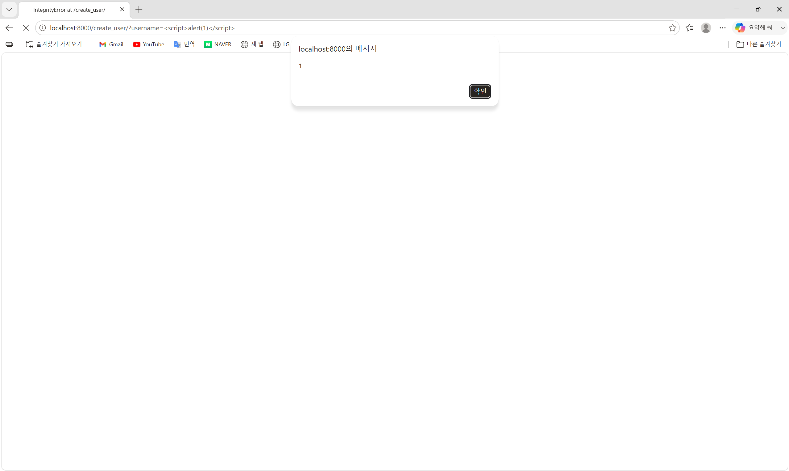
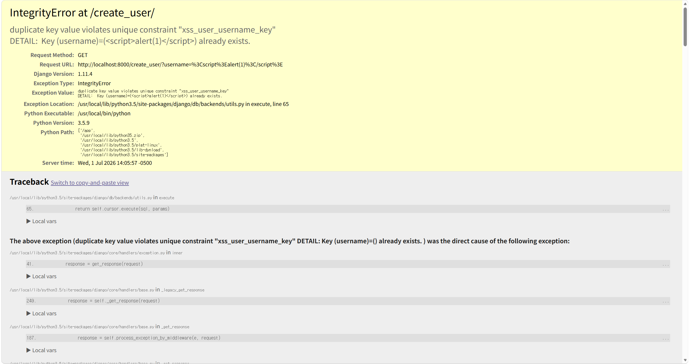

# Django Debug Page XSS (CVE-2017-12794)

> Django 1.11.4의 DEBUG 에러 페이지에서 발생하는 저장형(Stored) XSS 취약 환경 분석 보고서

## 1. 요약

Django 1.11.5 미만 버전은 `DEBUG = True` 상태에서 발생하는 500 에러 페이지(Technical 500 Template)에서 예외 메시지를 HTML로 출력할 때, 사용자가 제어할 수 있는 값을 안전하게 이스케이프(escape)하지 않는다.

공격자가 자바스크립트 코드를 포함한 값(예: `<script>alert(1)</script>`)을 데이터베이스 유니크 제약 위반을 일으키는 입력으로 사용하면, DB가 반환하는 에러 메시지에 해당 값이 그대로 포함된다. Django가 이 에러 메시지를 디버그 페이지에 이스케이프 없이 렌더링하면서, 삽입된 스크립트가 피해자의 브라우저에서 실행되는 XSS가 성립한다.

---

## 2. 분석

### 2.1 취약점 원리

이 취약점은 세 가지 조건이 겹칠 때 성립한다.

1. DEBUG 모드 활성화 — 운영 환경에서는 꺼야 할 DEBUG = True가 켜져 있어, 예외 발생 시 상세 디버그 페이지(Technical 500 Template)가 그대로 노출된다.
2. 사용자 입력이 예외 메시지에 포함됨 — PostgreSQL의 유니크 제약(unique constraint) 위반 시, 위반을 유발한 값이 에러 메시지(`DETAIL: Key (username)=(...) already exists.`)에 그대로 담겨 Django로 전달된다.
3. 디버그 템플릿의 이스케이프 누락 — Django 1.11.4의 디버그 템플릿(`django/views/debug.py`)은 예외 원인 값(`frame.exc_cause`)을 출력할 때 이스케이프 처리를 하지 않아, 값에 포함된 `<script>` 태그가 HTML 코드로 해석된다.

### 2.2 공격 흐름

```
[1차 요청] username=<script>alert(1)</script> 로 사용자 생성 → 정상 저장
        ↓
[2차 요청] 동일한 username 으로 다시 생성 시도
        ↓
PostgreSQL: "duplicate key ... already exists" 에러 (유니크 제약 위반)
        ↓
에러 메시지에 <script>alert(1)</script> 문자열이 그대로 포함
        ↓
Django 1.11.4 디버그 페이지가 이스케이프 없이 HTML 렌더링
        ↓
브라우저에서 <script> 실행 → alert(1) 팝업 (XSS 성립)
```

첫 번째 요청은 값을 심어두는 단계이고, 두 번째 요청에서 유니크 제약 위반 에러를 유발해 심어둔 값이 에러 메시지로 되돌아오면서 실행된다. 이처럼 저장된 값이 다른 시점의 에러를 통해 실행되는 형태라 저장형(Stored) XSS의 성격을 가진다.

### 2.3 패치 내용

Django 1.11.5에서는 디버그 템플릿의 해당 출력 지점에 강제 이스케이프(`force_escape`) 필터를 추가하여 이 문제를 수정했다.

```diff
- The above exception ({{ frame.exc_cause }}) was the direct cause of the following exception:
+ The above exception ({{ frame.exc_cause|force_escape }}) was the direct cause of the following exception:
```

`force_escape` 필터가 `<`, `>` 등의 특수문자를 `&lt;`, `&gt;`로 변환하므로, 이후 버전에서는 스크립트가 코드가 아닌 단순 문자열로 표시된다.

---

## 3. 환경 구성

### 3.1 요구 사항

- Docker / Docker Compose
- 인터넷 연결 (이미지 pull)

### 3.2 구성 파일

`docker-compose.yml`은 취약한 Django 1.11.4 웹 서버(`web`)와 PostgreSQL 9.6 데이터베이스(`db`) 두 개의 컨테이너로 구성된다. 웹 서버는 호스트 8000번 포트로 노출된다.

| 서비스 | 이미지 | 포트 |
|--------|--------|------|
| web | vulhub/django:1.11.4 | 8000:8000 |
| db | postgres:9.6-alpine | 5432 |

### 3.3 환경 실행

```bash
# 취약 환경 디렉터리로 이동 후 실행
docker compose up -d

# 컨테이너 상태 확인 (web, db 모두 Up 상태여야 함)
docker compose ps
```

---

## 4. 재현 절차

### 4.1 1차 요청 — 악성 사용자 생성

웹 브라우저에서 아래 URL에 접속한다. 사용자명에 스크립트 코드를 넣어 사용자를 생성한다.

```
http://localhost:8000/create_user/?username=<script>alert(1)</script>
```

정상적으로 사용자가 생성된다.

### 4.2 2차 요청 — 유니크 제약 위반 유발

**동일한 URL에 한 번 더 접속**한다 (또는 새로고침).

```
http://localhost:8000/create_user/?username=<script>alert(1)</script>
```

이미 존재하는 사용자명이므로 데이터베이스 유니크 제약 위반이 발생하고, 디버그 에러 페이지가 렌더링되는 시점에 삽입한 스크립트가 실행되어 `alert(1)` 팝업이 표시된다.

---

## 5. 실행 결과

### 5.1 XSS 실행 (alert 팝업)

2차 요청 시 삽입한 자바스크립트가 브라우저에서 실행되어 경고창이 표시된다.


### 5.2 디버그 에러 페이지

`alert` 확인 후 나타나는 Django 디버그 페이지에서, 에러 메시지에 삽입된 `<script>` 값이 이스케이프 없이 포함된 것을 확인할 수 있다.

- Exception Type: `IntegrityError`
- Exception Value: `duplicate key value violates unique constraint "xss_user_username_key" DETAIL: Key (username)=(<script>alert(1)</script>) already exists.`
- Django Version: `1.11.4`



---

## 6. 대응 방안

Django 업그레이드 - 1.11.5 / 1.10.8 이상으로 업그레이드하여 `force_escape` 패치 적용 
운영 환경 DEBUG 비활성화 - `settings.py`에서 `DEBUG = False` 설정. 디버그 페이지 자체를 노출하지 않음
입력값 검증/무해화 - 사용자명 등 입력에 대해 허용 문자 화이트리스트 검증 적용 
에러 페이지 분리 - 운영 환경 전용 커스텀 500/404 페이지를 사용하여 예외 상세 노출 차단 

### 핵심 정리

이 취약점의 근본 원인은 운영에 부적합한 `DEBUG = True` 설정과 디버그 템플릿의 이스케이프 누락이다. 따라서 대응의 핵심은 두 가지로 요약된다.

1. Django를 패치된 버전(1.11.5+)으로 올린다.
2. 운영 환경에서는 반드시 `DEBUG = False`로 둔다.

디버그 페이지는 개발 편의를 위해 내부 정보를 그대로 보여주도록 설계되어 있으므로, 그 자체가 운영 환경에서는 정보 노출 및 XSS의 통로가 될 수 있음을 인지해야 한다.
